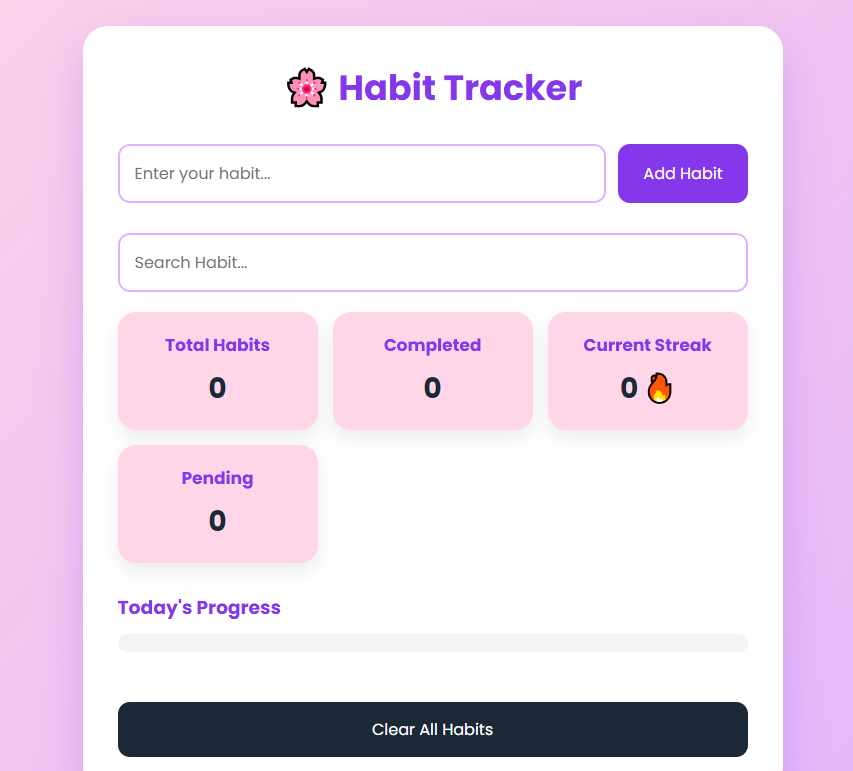

# 🌸 Habit Tracker

A modern and responsive Habit Tracker built with **HTML, CSS, and JavaScript**.

This application helps users build positive daily habits by allowing them to add, edit, complete, delete, and track habits with Local Storage support.

---

# ✨ Features

- ➕ Add New Habit
- ✏️ Edit Habit
- 🗑 Delete Habit
- ✅ Complete / Uncomplete Habit
- 📊 Progress Bar
- 🔥 Streak Counter
- 📈 Total Habits Counter
- ✔️ Completed Habits Counter
- ⏳ Pending Habits Counter
- 🔍 Search Habits
- 📅 Today's Date
- 🕒 Habit Creation Time
- 💾 Local Storage Support
- 🔄 Data Remains After Refresh
- 🧹 Clear All Habits
- 📱 Fully Responsive Design
- 🎨 Modern Purple & Pink User Interface

---

# 🛠️ Technologies Used

- HTML5
- CSS3
- JavaScript (ES6)
- Local Storage API

---

# 📂 Folder Structure

```
Habit-Tracker/
│
├── index.html
├── style.css
├── script.js
├── README.md
└── images/
    └── preview.png
```

---

# 🚀 How to Run

1. Download or Clone the repository.
2. Open the project in Visual Studio Code.
3. Install the **Live Server** extension.
4. Right-click on `index.html`.
5. Click **Open with Live Server**.

---

# 📸 Preview

Save a screenshot of your project inside the **images** folder with the name:

```
preview.png
```

Then add this line to display it on GitHub:

```md

```

---

# 💡 Future Improvements

- 🌙 Dark Mode
- 📅 Calendar View
- 📈 Weekly & Monthly Statistics
- 🎯 Daily Goals
- 🏆 Achievement Badges
- 🔔 Habit Reminder Notifications
- ☁️ Cloud Data Sync
- 👤 User Authentication
- 📊 Advanced Analytics Dashboard

---

# 👩‍💻 Author

**Taiba Shabbir**

Frontend Developer | JavaScript Learner | Building Real-World Web Projects

---

# ⭐ Support

If you found this project useful, please give it a ⭐ on GitHub.

---

# 📜 License

This project is open-source and available for learning and educational purposes.